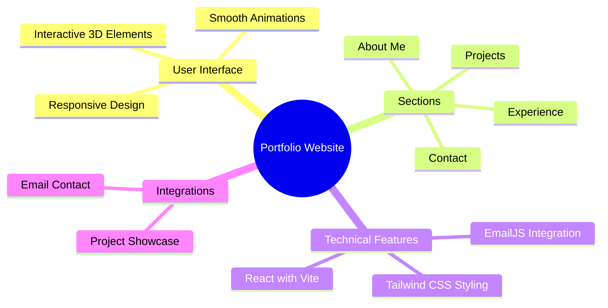

<div align="center">

# Premium Chauffeur Website

<p align="center">
  <a href="#features">Features</a> •
  <a href="#demo">Demo</a> •
  <a href="#installation">Installation</a> •
  <a href="#deployment">Deployment</a> •
  <a href="#tech-stack">Tech Stack</a>
</p>

[](https://reactjs.org)
[](https://www.premium-chauffeur.de)

<p align="center">A modern, responsive website for Premium Chauffeur services. Built with React, Vite, and Tailwind CSS, featuring smooth animations and interactive 3D elements. ✨</p>

</div>

## ✨ Features

<div align="center">



</div>

## 🚀 Demo

Experience the live website at [https://www.premium-chauffeur.de](https://www.premium-chauffeur.de)

## 🛠️ Installation

1️⃣ Clone the repository:

```bash
git clone https://github.com/lonesometrip/chauffeur.git
```

2️⃣ Navigate to project directory:

```bash
cd chauffeur
```

3️⃣ Install dependencies:

```bash
npm install
```

4️⃣ Run development server:

```bash
npm run dev
```

5️⃣ Open in browser:

- Visit [http://localhost:5173](http://localhost:5173) (or the port shown in your terminal)

## 🚀 Deployment

### GitHub Pages Deployment

1️⃣ Install the GitHub Pages package:

```bash
npm install gh-pages --save-dev
```

2️⃣ Add the following to your package.json:

```json
"homepage": "https://www.premium-chauffeur.de",
"scripts": {
  // other scripts
  "predeploy": "npm run build",
  "deploy": "gh-pages -d dist"
}
```

3️⃣ Create a CNAME file in the public directory:

```
www.premium-chauffeur.de
```

4️⃣ Deploy to GitHub Pages:

```bash
npm run deploy
```

5️⃣ Configure your custom domain in GitHub repository settings:
- Go to your repository on GitHub
- Navigate to Settings > Pages
- Under "Custom domain", enter your domain name
- Save and wait for DNS propagation

### Manual Deployment

If you're having issues with the GitHub Pages package, you can deploy manually:

1️⃣ Build the project:

```bash
npm run build
```

2️⃣ Commit and push your changes:

```bash
git add .
git commit -m "Update website"
git push origin main
```

3️⃣ Configure GitHub Pages in repository settings:
- Go to your repository on GitHub
- Navigate to Settings > Pages
- Set the source to the branch you want to deploy (usually main or gh-pages)
- Set the folder to /docs or /dist (depending on your build configuration)
- Add your custom domain www.premium-chauffeur.de
- Save and wait for DNS propagation

### DNS Configuration

To set up your custom domain with GitHub Pages:

1️⃣ Add these records to your DNS configuration:
- A record: @ → 185.199.108.153
- A record: @ → 185.199.109.153
- A record: @ → 185.199.110.153
- A record: @ → 185.199.111.153
- CNAME record: www → yourusername.github.io

## 💻 Tech Stack

<table align="center">
  <tr>
    <td align="center" width="96">
      
      <br>React
    </td>
      <td align="center" width="96">
      
      <br>Vite
    </td>
    <td align="center" width="96">
      
      <br>Tailwind CSS
    </td>
      <td align="center" width="96">
      
      <br>Three.js
    </td>
  </tr>
</table>

## ⚡ Core Features

- 📱 Responsive Design

  - Mobile-first approach
  - Seamless experience across all devices
  - Adaptive layouts and components

- 🎯 Dynamic Content

  - Interactive project showcase
  - Engaging experience section
  - Animated skill representations

- 🎨 Modern UI/UX

  - Smooth Framer Motion animations
  - Intuitive navigation
  - Clean and professional design
  - Interactive 3D elements using Three.js

- ✉️ Email Integration
  - Contact form using EmailJS

## 📄 License

<div align="center">

All Rights Reserved © Premium Chauffeur

</div>
